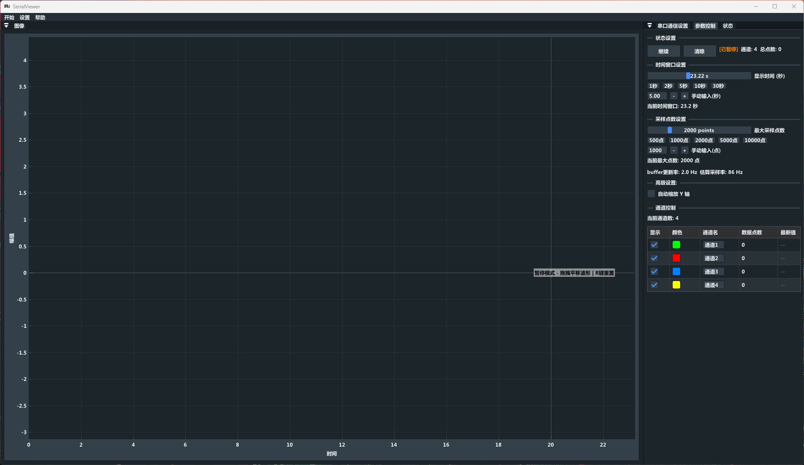

## SerialViewer

Simple serial port oscilloscope

## build

```
mkdir build && cd build
cmake ..

then open the SerialViewer.sln
```



### Frame Format

```
$ <float1> <float2> <float3> ... <floatN> ;
```

- `$` : start of frame
- `;` : end of frame
- Floats are separated by spaces
